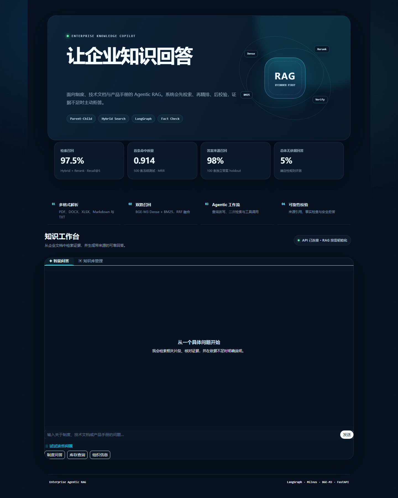
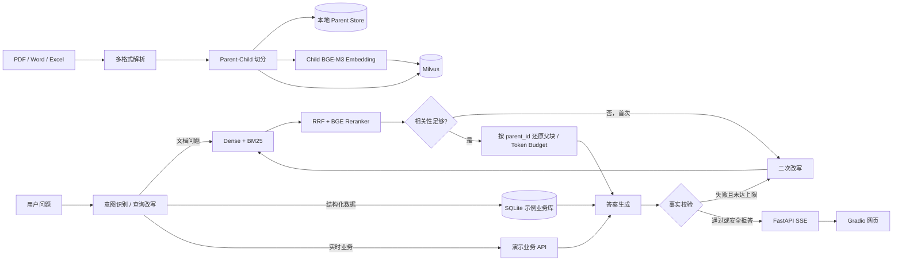

# 企业知识库 Agentic RAG


[](https://github.com/sortn/enterprise-agentic-rag/actions/workflows/ci.yml)

> 完整离线基准已跑通：500条冻结检索测试与100条独立答案holdout的协议、结果和限制见[评测报告](evaluation/benchmark_v1/REPORT.md)。

面向企业制度、技术文档和产品手册问答的可运行 Agentic RAG MVP：支持 PDF、Word、Excel、Markdown 文档入库，使用 Milvus 完成 BGE Dense + BM25 双路召回、RRF 融合和 BGE Reranker 重排序，再由 LangGraph 编排查询改写、工具调用、相关性判断、二次检索、回答生成与事实校验。

<p align="center">
  
</p>

> 我使用确定性脚本生成可复现的演示文档与评测集。仓库保留生成脚本、冻结配置和评测结果，文档由使用者按需生成。

## 实验摘要

| 对比 | Recall@5 | MRR | 说明 |
|---|---:|---:|---|
| Hybrid（Dense+BM25+RRF） | 78.6% | 0.5948 | 混合召回基线 |
| Hybrid+BGE Rerank | **97.5%** | **0.9141** | 精排后结果 |

独立100条答案holdout中，Agentic RAG取得84%关键词正确率、98%来源召回率和5%总体无依据回答率；对应代价是更高的端到端延迟。完整实验协议、置信区间、逐题结果与失败样本见[评测报告](evaluation/benchmark_v1/REPORT.md)。

## 核心能力

- 多格式入库：PDF / DOCX / XLSX / Markdown / TXT，保留页码、工作表和标题路径。
- Parent-Child 切分：父块全文持久化到 `data/parents/`，仅对子块生成向量；命中子块后按 `parent_id` 还原父块。
- 混合检索：`BAAI/bge-m3` Dense 召回 + Milvus BM25，使用 RRF 融合。
- 精排：`BAAI/bge-reranker-v2-m3` 对融合候选执行 Cross-Encoder 重排序。
- Agentic RAG：低相关度或事实校验失败时自动改写查询并进行第二次检索，最多两轮。
- 企业工具：Pydantic 校验的结构化数据库查询和演示业务接口；数据库只允许参数化白名单查询。
- 可靠回答：只依据文档/工具证据回答，输出来源位置，并在末端执行事实一致性检查。
- 工程接口：FastAPI 普通接口、经过事实校验后发送的 SSE 分片、Gradio 网页、Docker Compose。
- 离线评测：检索对照实验覆盖 Recall@K/MRR/延迟，回答评测覆盖引用召回、错误拒答和无依据回答率。

## 系统架构



LangGraph 的显式节点和路由在 `project/rag_agent/graph.py`，不会把关键流程藏在一个超长 Agent Prompt 中。

## 代码结构

```text
project/
├── api/                 FastAPI、SSE、文档接口和演示业务路由
├── core/                应用服务容器
├── db/                  父块本地持久化
├── ingestion/           多格式解析、切分、入库流水线
├── rag_agent/           LangGraph 状态、节点、边和企业工具
├── retrieval/           Milvus Schema、Dense/BM25/RRF/Reranker
├── services/            硅基流动、SQLite 和演示业务服务
├── tests/               不依赖真实模型的单元测试
├── ui/                  Gradio 企业工作台与自定义主题
├── config.py            唯一配置入口
└── app.py               启动入口

scripts/
├── generate_sample_documents.py
├── ingest_documents.py
├── generate_benchmark.py
├── run_retrieval_benchmark.py
├── run_grounding_benchmark.py
└── write_benchmark_report.py

evaluation/benchmark_v1/
docker-compose.yml
```

## 快速开始

### 1. 环境准备

建议使用 Python 3.11。Milvus Standalone 需要 Docker Desktop、WSL 2 后端和 Docker Compose V2。

```powershell
py -3.11 -m venv .venv
.venv\Scripts\Activate.ps1
python -m pip install -U pip
pip install -r requirements.txt
```

Linux/macOS将前两行替换为`python3.11 -m venv .venv`和`source .venv/bin/activate`即可。
如需与已验证环境完全一致，可将安装命令替换为`pip install -r requirements-lock.txt`。

### 2. 配置模型 API

复制示例文件：

```powershell
Copy-Item project\.env.example project\.env
```

Linux/macOS使用`cp project/.env.example project/.env`。

至少填写 `SILICONFLOW_API_KEY`。默认模型名不带 `Pro/` 前缀：

```dotenv
LLM_MODEL=Qwen/Qwen3-8B
EMBEDDING_MODEL=BAAI/bge-m3
RERANK_MODEL=BAAI/bge-reranker-v2-m3
```

我将模型密钥保存在本地 `project/.env`；根目录 `.gitignore` 已忽略所有 `.env`。

### 3. 生成演示企业文档

```powershell
python scripts\generate_sample_documents.py
```

命令会生成四份DOCX、PDF、XLSX和Markdown演示文档，统一写入`sample_data/generated/`。

### 4. 启动 Milvus

```powershell
docker compose up -d etcd minio milvus
docker compose ps
```

容器健康后即可启动应用服务。

### 5. 启动后端和网页

```powershell
python project\app.py
```

启动后可使用 Gradio 工作台、FastAPI 交互文档以及 live/ready 健康探针。

在“文档管理”页上传 `sample_data/generated/` 下的四份文件，再进入“知识问答”。

也可以使用批量入库命令：

```powershell
python scripts\ingest_documents.py sample_data\generated
```

### 6. 全容器部署

```powershell
docker compose up -d --build
```

应用容器和 Milvus、etcd、MinIO 会一起启动。

> Compose 默认将管理端口绑定到本机回环地址；公网部署可在此基础上接入认证、租户隔离和细粒度文档权限。

## API 示例

普通回答接口为 `POST /api/v1/chat`，请求体示例：

```json
{
  "question": "住宿费超标后怎么办？"
}
```

SSE 流式接口为 `POST /api/v1/chat/stream`，依次返回 `start`、`node`、`token`、`final` 事件。为防止未经校验的幻觉内容提前泄露，`token` 是 Fact-Check 完成后对最终答案进行的安全分片。最终结果分别使用 `grounded` 表示回答得到证据支持、`refused` 表示系统因证据不足而拒答，避免把安全拒答误标成有依据回答。兼容接口 `POST /api/upload_doc` 和 `GET /api/stream_chat?question=...` 也已保留。

## 离线评测

仓库保留冻结配置、问题集、标签、汇总结果与逐题证据。完整复现时先通过脚本生成50份评测文档：

```powershell
python scripts\generate_benchmark.py
python scripts\validate_benchmark.py --parse-corpus
python scripts\index_benchmark.py --reset
python scripts\link_ground_truth.py
python scripts\validate_benchmark.py --require-linked
```

运行冻结的500条检索测试：

```powershell
python scripts\run_retrieval_benchmark.py --dataset retrieval_test.jsonl --run-name test_v1 --k 5 --restart
```

运行独立答案holdout：

```powershell
python scripts\generate_grounding_holdout.py
python scripts\run_grounding_benchmark.py --dataset grounding_holdout_v1.jsonl --run-name grounding_holdout_v1 --max-workers 2 --restart
```

实验协议、置信区间、延迟代价、失败样本和数据哈希见[离线基准评测报告](evaluation/benchmark_v1/REPORT.md)。

## 测试

```powershell
python -m pytest project\tests -q
```

单元测试通过可控替身覆盖解析、父子分块、父块持久化、上下文还原、LangGraph路由、降级检索、参数校验、演示工具初始化和SSE分片。GitHub Actions会在push和pull request时自动执行同一套测试并构建应用镜像。

## 可靠性设计

- 模型、Embedding、Reranker 请求均有超时和指数退避重试。
- 查询改写最多触发一次，整个检索最多两轮，避免 Agent 无限循环。
- 工具参数由 Pydantic 验证；结构化数据库不接受模型生成的任意 SQL。
- 子块只负责召回，生成前去重并还原父块全文，再按近似 token budget 裁剪上下文。
- Milvus Hybrid、Dense、BM25 或 Reranker 单项故障时执行可用单路降级；全部不可用才安全拒答。
- 检索不足时拒答；生成后再做证据一致性检查，不通过会在上限内二次检索，仍失败则拒答。
- 上传文件限制扩展名、大小，并使用安全文件名。
- 回答保留文件名和页码/工作表/标题路径，便于人工复核。

## 设计边界

- [当前实现限制](design/LIMITATIONS.md)：记录解析、切分、检索、状态一致性和安全方面仍待解决的问题。
- [面向生产的目标架构](design/PRODUCTION_ARCHITECTURE.md)：记录下一阶段架构、里程碑与验收标准。

## 项目来源与独立改造

我以 Giovanni Pasqualino 的 MIT 项目 [agentic-rag-for-dummies](https://github.com/GiovanniPasq/agentic-rag-for-dummies) 作为早期 LangGraph 学习参考，并围绕企业知识问答重构了多格式解析、Milvus Schema、BGE API、BM25/RRF/Reranker、企业工具、可靠性工作流、FastAPI SSE、评测体系和 Docker Compose。

| 改造领域 | 当前仓库中的可核验实现 |
|---|---|
| 文档入库 | 多格式解析、Parent-Child 切分、父块持久化与批量入库脚本 |
| 检索链路 | Milvus Dense/BM25、RRF、BGE Reranker及单路故障降级 |
| Agent 工作流 | 显式 LangGraph 节点、有限重试、企业工具、证据校验与安全拒答 |
| 服务与交互 | FastAPI、校验后 SSE、文档管理 API 和 Gradio 工作台 |
| 实验验证 | 冻结评测数据、逐题结果、置信区间和失败样本 |
| 工程交付 | Docker Compose、依赖锁定、单元测试、CI 与公开限制清单 |

本项目继续采用MIT License，我在[NOTICE](NOTICE.md)中记录了基础归属与独立改造范围。
